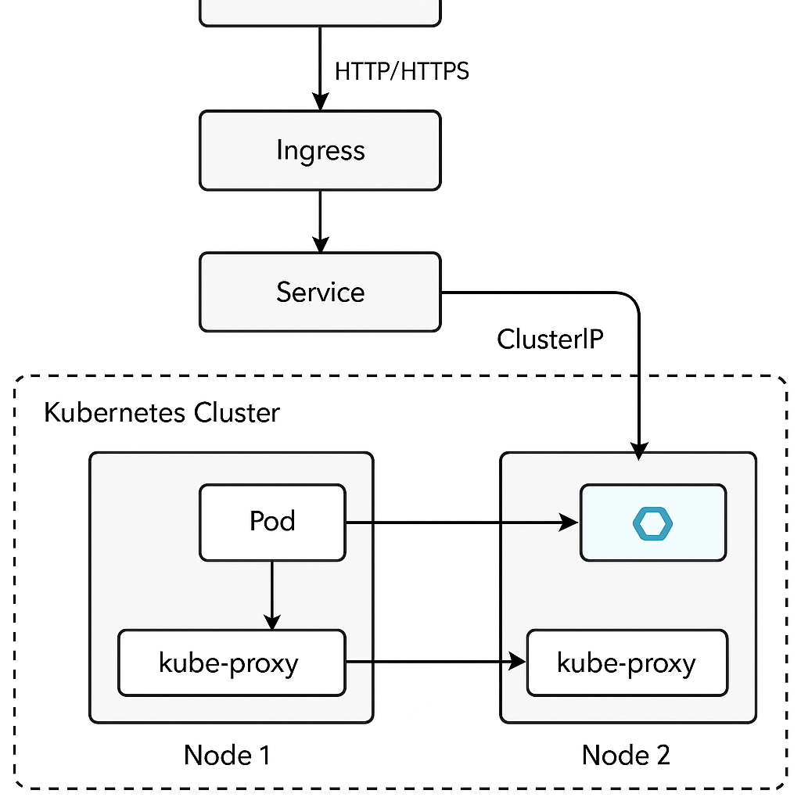

Kubernetes 的网络模型是其核心架构之一，理解它可以帮助你搞清楚 Pod 之间、服务之间、外部访问、以及负载均衡是怎么实现的。下面从**概念 → 架构 → 技术实现 → 常见模型**，给你系统讲一遍。

---

## ✅ 一、Kubernetes 网络模型核心理念

K8s 网络模型基于 **统一扁平网络** 的理念：

> **每个 Pod 都有一个唯一 IP，Pod 之间可以直接通信，不需要 NAT。**

### 核心三条规则（必须实现）：

1. **Pod 能与集群中所有 Pod 通信**（跨 Node 通信）
2. **节点能与所有 Pod 通信，反之亦然**
3. **Pod 与 Service 通信稳定（Service 虚拟 IP）**

---

## ✅ 二、Kubernetes 网络模型结构图

```
            ┌────────────────────────────────────┐
            │        Kubernetes Cluster          │
            │                                    │
            │    ┌─────────────┐     ┌────────┐  │
            │    │  Node1      │     │ Node2  │  │
            │    │ ┌───────┐   │     │ ┌────┐ │  │
 External   │    │ │ PodA  │◄──┼─────┼►│PodB│ │  │
Clients ────┼────┼─└───────┘   │     │ └────┘ │  │
            │    │ kubelet     │     │        │  │
            │    │ kube-proxy  │     │ kube-proxy│
            │    └─────────────┘     └────────────┘
            │                                    │
            └────────────────────────────────────┘
```

---

## ✅ 三、涉及的网络组件

| 名称                        | 作用                                            |
| ------------------------- | --------------------------------------------- |
| **Pod 网络（CNI）**           | 为每个 Pod 分配 IP，使其能直接通信（如 Flannel、Calico）       |
| **Service 网络（ClusterIP）** | 提供一个虚拟 IP 用于服务发现和负载均衡                         |
| **kube-proxy**            | 负责维护 Service 与后端 Pod 的网络转发规则                  |
| **DNS（CoreDNS）**          | 让服务通过名称访问，如 `myapp.default.svc.cluster.local` |
| **Ingress**               | 提供 HTTP 方式从外部访问集群内服务的方式（7层负载均衡）               |

---

## ✅ 四、技术细节：Pod 网络如何打通？

K8s 本身不提供网络实现，而是借助 **CNI 插件**，常见方案包括：

| 插件          | 网络模式             | 特点             |
| ----------- | ---------------- | -------------- |
| **Flannel** | VXLAN            | 简单、稳定、适合中小集群   |
| **Calico**  | BGP/Overlay      | 性能高，支持网络策略     |
| **Cilium**  | eBPF             | 高性能、支持 L7 安全策略 |
| **Canal**   | Flannel + Calico | 兼顾易用和网络策略      |

这些插件会帮你实现：

* 为每个 Pod 分配 IP
* 在不同 Node 上创建虚拟网络接口
* 配置路由或隧道打通跨节点的 Pod 网络

---

## ✅ 五、Service 网络与 kube-proxy 工作原理

### 1. ClusterIP 是什么？

* 每个 Service 会分配一个虚拟 IP（clusterIP）
* kube-proxy 会把这个 IP 映射到后端的 Pod 列表（Endpoints）

### 2. kube-proxy 三种模式：

| 模式            | 原理                 | 特点      |
| ------------- | ------------------ | ------- |
| iptables      | 使用 iptables 规则实现转发 | 经典模式    |
| ipvs          | 使用 Linux IPVS 实现转发 | 更高性能    |
| userspace（废弃） | kube-proxy 监听并转发流量 | 性能差，不推荐 |

---

## ✅ 六、外部访问方式

| 类型               | 说明                                      |
| ---------------- | --------------------------------------- |
| **NodePort**     | 每个 Node 开一个端口映射 Service（范围 30000–32767） |
| **LoadBalancer** | 云厂商环境通过云负载均衡实现                          |
| **Ingress**      | 基于域名 + 路径的 HTTP(S) 路由入口控制器（7层）          |

---

## ✅ 七、网络策略（NetworkPolicy）

用于控制 **Pod 之间能否访问** 的安全策略：

```yaml
apiVersion: networking.k8s.io/v1
kind: NetworkPolicy
metadata:
  name: deny-all
spec:
  podSelector: {}
  policyTypes:
    - Ingress
    - Egress
```

需要你的网络插件（如 Calico）支持才生效。

---

## ✅ 八、总结关键点

| 模块            | 功能                 |
| ------------- | ------------------ |
| Pod 网络        | 每个 Pod 一个 IP，可直接通信 |
| CNI 插件        | 提供 Pod 网络的实现       |
| Service       | 提供稳定访问入口           |
| kube-proxy    | 转发 Service 流量      |
| DNS           | 实现服务名解析            |
| Ingress       | 暴露服务到外部            |
| NetworkPolicy | 网络访问控制策略           |

---

